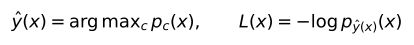
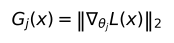
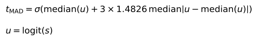
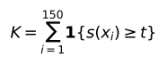
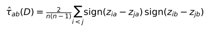

## 1. Experiment Update - 04/10/2026

I changed the supervised detector so that its features no longer require the incoming image-class labels. I kept one gradient norm per weight or bias tensor, removed true-class probability, and recomputed the gradients using the model's predicted class. I then tested three threshold rules in a small experiment with EWC and reckless BrainWash.

On Task 9, the corrected detector reached a ROC-AUC of 0.996464. The rule selected on Task 4 flagged 5 of 500 clean images and detected 488 of 500 poisoned images. At the dataset level, it flagged 4 of 100 clean simulations and all 100 simulations containing 8 poisoned images out of 150. Detection was weaker when there were only 2 poisoned images.

This report covers that experiment. The sample-level and dataset-level results in Sections 5–7 all use the supervised logistic regression. Rank is a separate unsupervised experiment, explained in Section 8; I did not rerun Rank or MMD in this round. I have left the other CL methods, attack settings and feature ablations until we agree on the feature definitions and threshold procedure.

---

## 2. Experimental Setup

### 2.1 Task Roles

| Component | Setting |
| --------- | ------- |
| Benchmark | Split CIFAR-100 |
| CL method | EWC |
| Experiment seed | 5 |
| Source task | Task 1: fit the scaler and supervised classifier |
| Calibration tasks | Tasks 1 and 4: clean validation and reserve samples |
| Development task | Task 4: choose among the threshold rules |
| Final evaluation task | Task 9 |
| Detector | StandardScaler followed by logistic regression |
| Training views | Task 1 clean and BrainWash-poisoned images |
| Random-control views | Evaluation only |
| Target fitting or calibration | None |

Task numbering starts at zero. For each task, features are extracted from the defender before it learns that incoming task. Task 1 and Task 4 therefore use their own earlier checkpoints, while Task 9 uses the checkpoint after Tasks 0–8. The fitted scaler and logistic classifier stay unchanged across these tasks.

Task 4 supplies separate clean data for calibration and a test split for choosing the rule. After that choice, I freeze the classifier and both thresholds before evaluating Task 9. I retain the Task 9 results for all three rules so that the comparison is visible, but the reported detector is the one selected on Task 4.

Seed 5 is a new run for this feature correction and threshold comparison. The benchmark and task pair have already been studied, so Task 9 is reserved from selection in this experiment rather than being a previously unexplored benchmark.

### 2.2 Training and Attack Configuration

| Component | Setting |
| --------- | ------- |
| Victim training | 100 epochs per learned task |
| EWC regularisation coefficient | 500,000 |
| Historical inversion | 2,000 iterations |
| Attack | BrainWash, reckless mode |
| Perturbation budget | L-infinity budget of 0.3 |
| Attack optimisation | 5,000 epochs; `n_iters = 1` |
| Attack flags | `real = false`, `reverse = false` |
| Random control | Uniform perturbations in [-0.3, 0.3], followed by image clamping |

The random control uses the same L-infinity budget as the attack. Its L2 norm is not matched to the BrainWash perturbation. This differs from the norm-matched controls in the 02/10 report.

BrainWash is generated on the incoming task's training images before the detector evaluation. The detector-test originals are held out from fitting the detector, but they are included in attack generation. I generate one attack artifact per task, rather than a new attack for each simulated dataset.

### 2.3 Data Splits

| Split | Original images per task | Use |
| ----- | -----------------------: | --- |
| Train | 3,000 | Fit the detector on Task 1 only |
| Validation | 500 | Set sample cutoffs using clean images from Tasks 1 and 4 |
| Reserve | 1,000 | Set dataset count cutoffs using separate clean images from Tasks 1 and 4 |
| Test | 500 | Select the rule on Task 4; evaluate the frozen detector on Task 9 |

All views of an original image stay in the same split. Task 1 training uses 3,000 clean and 3,000 poisoned views. Each task's feature file contains 15,000 rows: clean, poisoned and random-control views of its 5,000 originals. Task 9's train, validation and reserve rows are not used to fit or calibrate the detector.

### 2.4 Logistic Regression Training

I use two versions of each of the 3,000 Task 1 detector-training images:

| Detector label | Training example | Number |
| -------------- | ---------------- | -----: |
| Negative (0) | Original, unmodified Task 1 image | 3,000 |
| Positive (1) | BrainWash-poisoned version of the same image | 3,000 |

These are real Split CIFAR-100 images, not historical inversion samples. The poisoned versions come from the Task 1 reckless BrainWash attack with an L-infinity budget of 0.3. Random-control images are not included as training negatives.

I extract the 84 features listed in Section 3.2 from each version, fit StandardScaler on these 6,000 training rows, and fit the logistic regression on the scaled features and the binary labels above. The two versions share an original image, so these are 6,000 feature rows from 3,000 originals, not 6,000 independent originals.

The training labels identify whether I applied BrainWash; they are not the image's CIFAR-100 class. Task 4 supplies calibration data and the development comparison of threshold rules, but no rows for fitting the scaler or regression. Both remain frozen when I score Task 9.

---

## 3. Corrected Features

### 3.1 Predicted-Class Gradients

The earlier supervised experiments used the true image class when computing the loss and gradients. Removing true-class probability alone would have left that dependence in place.

For this experiment, I take the frozen model's prediction and use it as the cross-entropy target:

I treat the selected class as fixed when differentiating. For each backbone weight or bias tensor, the feature is

This gives 80 gradient features. Classification-head parameters are excluded from the norms, although the head affects the gradient propagated to the backbone. The model stays in evaluation mode, with no parameter or BatchNorm updates.

The incoming head is initialised with a fixed seed and has not been trained on incoming-task labels. The predicted class supplies a label-free target for differentiation; it should not be interpreted as a reliable prediction from a trained incoming-task classifier.

### 3.2 Inputs to the Detector

| Feature | Dimensions | Meaning |
| ------- | ---------: | ------- |
| Parameter-tensor gradient norms | 80 | Gradient magnitude for each backbone weight or bias tensor |
| Entropy | 1 | −∑ pc log pc, summed over classes: how spread out the predicted probabilities are |
| Confidence | 1 | maxc pc: the largest predicted probability |
| Margin | 1 | Difference between the largest and second-largest probabilities |
| Activation norm | 1 | L2 norm of the backbone representation entering the incoming head |
| Total | 84 | Inputs to the scaler and logistic regression |

True-class probability is omitted. Loss and historical-gradient cosine features are also excluded from the classifier. The predicted-target loss is used to obtain gradients, rather than being an additional input.

Image-class labels are still used in the offline benchmark and class-stratified split construction. They are not inputs to the revised feature extraction or deployment scoring. Clean/poison labels are used to train the source detector and measure performance, so this remains a supervised method. It also assumes that known-clean historical data are available for calibration.

---

## 4. Threshold Rules

### 4.1 Sample Cutoff

The fitted logistic regression assigns each image a score s(x), using its output for the positive class (poisoned). This is a detector score, not a calibrated probability that a future image or dataset is poisoned. I tested the following rules for deciding when that score is suspicious:

| Rule | How the sample cutoff is chosen |
| ---- | ------------------------------- |
| Source quantile (`source_quantile`) | Use Task 1 validation-clean scores, allowing at most 5% empirical alerts; handle tied scores conservatively |
| Historical quantiles (`history_quantile`) | Calculate the clean quantile cutoff separately for Tasks 1 and 4, then take the larger value |
| Historical median/MAD (`history_mad`) | Calculate a robust cutoff on each task's logit scores, keep the larger of that cutoff and the clean quantile, then take the larger value across tasks |

For the MAD rule, I clip scores to [1e-12, 1 - 1e-12] before converting them to logits. On each task, the robust cutoff is the logistic transform of the median logit plus three scaled median absolute deviations:

The multiplier is fixed at three. This is a heuristic for choosing a more conservative sample cutoff, not a guarantee under a change of task.

### 4.2 From Sample Scores to a Dataset Decision

I use the same logistic regression for the supervised dataset-level predictions. There is no second fitted classifier at this level: I aggregate its image scores using a count rule. Rank is not involved in the results in Sections 5–7.

For a dataset of 150 images, I count the scores at or above the sample cutoff:

The dataset alerts when K ≥ k. The sample cutoff t and the count cutoff k are calibrated separately.

After fixing t, I count alerts among each calibration task's 1,000 reserve-clean images. I calculate a one-sided Clopper–Pearson upper bound on the clean image-alert rate, then choose the smallest count whose binomial upper tail is at most 0.025. The other 0.025 of the nominal 5% budget is assigned to estimating the image-alert rate. For the historical rules, I use the largest task-wise upper bound.

With the selected MAD cutoff, Task 1 had 0 reserve alerts and Task 4 had 1. Task 4 supplied the larger upper bound, 0.005559, giving a count cutoff of 4. The frozen decision is therefore: alert if at least 4 of the 150 images have scores at or above 0.496810.

These calculations assume stable clean alert probabilities and independent images. They do not establish a 5% error bound on a different task. The Task 9 clean simulations are the empirical check of how well the rule transfers.

### 4.3 Selection on Task 4

I first require both the sample and dataset clean-alert rates on the development test split to be at most 5%. Among the rules that meet this condition, I choose the highest mean dataset detection rate at requested poisoning fractions of 10%, 25%, 50% and 100%.

| Rule | Clean Sample FPR | Clean Dataset FPR | Mean Detection at Selection Fractions |
| ---- | ---------------: | ----------------: | ------------------------------------: |
| Source quantile | 2.0% | 0.0% | 99.5% |
| Historical quantiles | 2.0% | 0.0% | 99.5% |
| Historical median/MAD | 0.0% | 0.0% | 100.0% |

All three rules met the development criterion. The selection procedure chose `history_mad`. Its mean detection advantage was only 0.5 percentage points, so this is a small development comparison rather than strong evidence that it will always be the better rule.

---

## 5. Sample-Level Results on Task 9

All three rules use the same fitted classifier and produce the same scores. Their ROC-AUC is therefore identical; only their decisions differ.

| Rule | Sample Cutoff | Dataset Count Cutoff | ROC-AUC | Clean Sample FPR | Poison Sample TPR |
| ---- | ------------: | -------------------: | ------: | ---------------: | ----------------: |
| Source quantile | 0.003652 | 16 | 0.996464 | 3.2% | 100.0% |
| Historical quantiles | 0.003652 | 16 | 0.996464 | 3.2% | 100.0% |
| Historical median/MAD | 0.496810 | 4 | 0.996464 | 1.0% | 97.6% |

For the selected MAD rule, the counts were:

| Actual View | No Alert | Alert |
| ----------- | -------: | ----: |
| Clean | 495 | 5 |
| Poisoned | 12 | 488 |

Average precision was 0.992940 and balanced accuracy was 98.3%. The predicted-gradient features still separate the two views well in this setting.

The two quantile rules produced the same cutoff in this run. Adding Task 4 did not raise their sample threshold. For the MAD rule, Task 1 supplied the larger sample cutoff: 0.496810, compared with 0.208726 on Task 4. Task 4 affected the count calibration and rule selection. These results do not show that simply adding a historical task improves detection.

The earlier report used true-class gradients, different seeds and different random controls. I cannot attribute a change from those results solely to the new threshold procedure.

---

## 6. Dataset-Level Results

### 6.1 Construction of the Simulated Datasets

There is one underlying incoming task. The repeated datasets are mixtures sampled from its 500 detector-test originals.

For each simulation, I draw 150 original-image IDs without replacement. At a requested poisoning fraction r, I use poisoned views for m = ⌊150r + 0.5⌋ of them and clean views for the rest. Each original appears once within that dataset. A random-control simulation replaces the poisoned views with uniformly perturbed views.

I repeat the sampling 100 times per fraction and perturbation type. Images can recur across simulations, and every poisoned view comes from the same task-level attack artifact. These are repeated measurements on a finite pool, not 100 independently collected tasks or attacks. All threshold rules are evaluated on the same sampled datasets. The zero-contamination datasets are also identical in the poison and random-control evaluations, so their two clean rows do not represent separate clean experiments.

In deployment, an incoming dataset of 150 images receives one decision. Repeated sampling is an offline way to examine sensitivity to the mixture and selected images. A different dataset size would need its own count calibration.

### 6.2 Detection by Poisoning Fraction

| Poisoned Images / 150 | Actual Poisoned Fraction | Source Quantile | Historical Quantiles | Selected MAD Rule |
| --------------------- | -----------------------: | --------------: | -------------------: | ----------------: |
| 0 | 0% | 0% | 0% | 4% |
| 2 | 1.33% | 0% | 0% | 42% |
| 8 | 5.33% | 8% | 8% | 100% |
| 15 | 10% | 98% | 98% | 100% |
| 38 | 25.33% | 100% | 100% | 100% |
| 75 | 50% | 100% | 100% | 100% |
| 150 | 100% | 100% | 100% | 100% |

The clean row is the dataset false-positive rate. The other rows give detection rates, each out of 100 simulations.

The MAD rule trades a higher clean-dataset alert rate for better detection at low poisoning fractions. It rejects 4 clean simulations, whereas the quantile rules reject none. At 8 poisoned images, however, it detects all simulations, compared with 8% for the quantile rules.

The change comes from both thresholds. The higher sample cutoff reduces clean image alerts, which allows the reserve-based count cutoff to fall from 16 to 4. More poisoned images miss the sample cutoff, but fewer suspicious images are needed for a dataset alert.

Detection at 2 poisoned images needs particular care. With a count cutoff of 4, those two images cannot trigger an alert by themselves. Every alerted simulation at this fraction included at least two clean images above the sample cutoff. The observed 42% therefore partly depends on clean false alerts. I would not describe this as reliable detection of such a small amount of poisoning.

---

## 7. Random-Perturbation Results

The selected rule flagged 18 of 500 random-control images, an alert rate of 3.6%. Its poison-versus-random ROC-AUC was 0.993724.

| Randomly Modified Images / 150 | Actual Modified Fraction | Dataset Alert Rate |
| ----------------------------- | -----------------------: | -----------------: |
| 0 | 0% | 4% |
| 2 | 1.33% | 4% |
| 8 | 5.33% | 5% |
| 15 | 10% | 11% |
| 38 | 25.33% | 26% |
| 75 | 50% | 49% |
| 150 | 100% | 85% |

The alert rate rises as more images are perturbed. Even though only 3.6% of individual random-control images are flagged, enough can accumulate to reach the four-image cutoff in a heavily modified dataset.

Following your comment, I report these as alerts on perturbed data rather than treating every random-control alert as a false positive on harmless data. I have not measured the forgetting caused by this round's uniform perturbations, so these results alone cannot establish whether the alerts identify harmful training data.

---

## 8. Clarification of Rank

### 8.1 Why I Tested a Separate Unsupervised Method

The supervised method above needs labelled clean and poisoned source examples to train the logistic regression, and known-clean historical images to calibrate its thresholds. I tested Rank separately for a setting where I do not train a clean/poison classifier and do not use known-clean incoming-task images for calibration. Its references are inversion samples from historical tasks.

Rank does not replace the logistic regression in the supervised experiment. It makes a direct comparison of feature relationships across a dataset, rather than predicting clean/poison labels for individual images and counting them. I have not shown that it is better than the supervised method.

### 8.2 Correlations Across a Dataset

Each image supplies ten descriptors: the global gradient norm, five stage gradient norms, entropy, confidence, margin and activation norm. Gradients use the predicted class. Across the images in a dataset, I compute Kendall's tau-a for each pair of descriptors, giving at most 45 correlations. This vector describes how the features vary together over the dataset.

For feature pair (a, b), the correlation is

Tied values contribute zero. I compare this profile separately with the inversion reference from each historical task. For Task 9, those references come from Tasks 0–8. Reference images and incoming images are measured using the same frozen Task 9 defender and incoming head.

### 8.3 Which Feature Pairs Are Retained

I keep at most 256 inversion images per historical task. For each feature pair in a reference of n images, I calculate the full-reference correlation τ and the correlation τ−i obtained by leaving out image i. The jackknife pseudovalue for that image is

Pi = nτ − (n − 1)τ−i.

The pseudovalues describe how individual images affect the correlation estimate. I keep a feature pair only if their variance is above 10⁻¹² in every historical reference. This is what I meant by “nondegenerate jackknife variation”: the estimated first-order variation must not be effectively zero. For example, a pair with the same perfect ordering before and after every deletion has constant pseudovalues and is excluded.

This is a check for whether the bootstrap approximation below can be used, not a ranking of features by detection performance. The retained pairs are fixed using historical references only. No incoming clean/poison labels are used to select them. If no pair passes the check in every reference, the implementation does not fit the test.

### 8.4 What the 499 Bootstrap Draws Do

For each historical comparison, the observed statistic is the largest absolute difference between the incoming and reference correlations over the retained feature pairs. The bootstrap approximates how much that statistic could vary through sampling, under a match of those correlations.

I first centre the jackknife pseudovalues by subtracting their mean, for both the incoming dataset and the historical reference. In each draw, I assign an independent standard-normal weight wi to each image. For each feature pair, the simulated error is

E = ∑i=1n wi(Pi − P̄) / √[n(n − 1)].

Within a dataset, I use the same image weights for all feature pairs so that the simulation keeps their joint variation. I draw separate weights for the incoming images and the historical reference images, subtract the reference error vector from the incoming error vector, and take the largest absolute entry.

I repeat this 499 times. For each reference, the approximate p-value is

p = (1 + number of bootstrap statistics at least as large as the observed maximum absolute correlation difference) / 500.

The smallest possible p-value is therefore 0.002. These are 499 random-weight calculations on the existing features, not 499 newly generated or sampled image datasets. They are also separate from the repeated 150-image mixtures used to evaluate detection rates in Section 6.

### 8.5 Final Decision and Assumptions

The final value is the largest historical p-value. Rank alerts when this value is at most 0.05, so every historical reference must reject a match. If one comparison has a p-value of 0.20, the dataset does not alert even when the other comparisons reject. Failure to reject does not prove that it is clean. Constant incoming features can make the test unsupported; this is recorded separately through test coverage.

The bootstrap is an approximation, not an exact finite-sample test. It relies on independent observations and nondegenerate first-order variation. The historical pair check addresses the latter in the references, but it does not establish independence among inversion samples or guarantee that real clean images match an inversion reference. Heavy ties and small sample sizes can also make the approximation unreliable.

The output indicates disagreement with historical feature relationships. A clean task can differ from all inversion references, and poisoning can sometimes preserve those relationships. This explains why a nominal test level does not automatically give the desired clean-data error rate or detection power. The mixture construction in Section 6 also explains the repeated datasets used in the earlier Rank evaluation.

There are no new Rank or MMD results in this report. The seed 1 and seed 2 results remain in the [02/10 report](result-02-10-2026.md).

---

## 9. Discussion and Next Step

The main result of this round is that the supervised detector still works well after removing the dependence on incoming image-class labels. The selected threshold rule also transfers reasonably in this run: it flags 4% of clean Task 9 simulations and detects all tested simulations with at least 8 poisoned images out of 150.

I would keep the MAD rule as the current candidate. Its lower count cutoff makes it more useful than the quantile rules at the smaller fractions tested here. Detection with only two poisoned images remains weak and depends on clean false alerts. The observed 4% clean-dataset rate is also a result from this finite-pool simulation, not a bound on future tasks.

This experiment uses one seed, one CL method and one attack configuration. It does not yet establish that the threshold transfers across the broader settings. I have not run feature-removal ablations or tested whether filtering the flagged images improves subsequent CL accuracy.

Before extending the experiments, I would like to check whether this feature definition, the historical clean calibration and the two-threshold dataset rule are suitable for the thesis. Once the methodology is agreed, I can keep it fixed for the additional methods, attacks and ablations, and report both the successful and failed settings.
