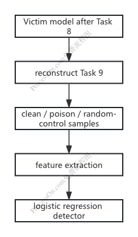

## 1. Experiment Objective
The goal of this experiment is to investigate whether a set of features can distinguish poisoned samples from clean samples in a continual learning setting. The detector uses three pre-training features: the loss, the backbone gradient norm, and the cosine similarity with the past-task gradient direction. In future experiments, I will consider incorporating additional features to further improve detection performance.

## 2. Experimental Setup
Overview of the detector pipeline, including Task 9 sample construction, feature extraction and logistic-regression detector training.


### 2.1 Victim Model and Training Setting

The victim model is trained with EWC on tasks 0--8, and the checkpoint is saved before learning Task 9.

| Component | Setting |
|-----------|---------|
| Dataset | Split CIFAR-100 |
| Approach | EWC |
| Number of tasks | 10 |
| Incoming task | Task 9 |
| Epochs | 20 |
| Batch size | 16 |
| Lamb | 500000 |
| Gradient clipping | 100.0 |
| Learning rate | 0.01 |

### 2.2 Model Inversion for Past Tasks

Performs model inversion on a pretrained EWC model

| Component | Setting |
|-----------|---------|
| Pretrained model | `runs/victim_seed0/checkpoint.pkl` |
| Inverted tasks | Tasks 0--8 |
| Number of samples | 128 |
| Output directory | `cifar100_inverted_data_ewc` |
| Save frequency | Every 1000 iterations |
| Batch regularization | Enabled |
| Initial accuracy evaluation | Enabled |
| Number of inversion iterations | 10000 |

### 2.3 Poisoning Process

| Component | Setting |
|-----------|---------|
| Extra description | `detector_baseline` |
| Pretrained model | `runs/victim_seed0/checkpoint.pkl` |
| Attack mode | `reckless` |
| Target task for evaluation | 0 |
| Perturbation budget ($\ell_\infty$) | 0.3 |
| Random seed | 0 |
| Evaluation frequency | Every 10 epochs |
| Distillation folder | `cifar100_inverted_data_ewc` |
| Initial accuracy evaluation | Enabled |
| Noise norm constraint | $\ell_\infty$ norm |
| Continual learner learning rate | 0.001 |
| Number of epochs | 5000 |
| Iterations per epoch | 1 |
| Head reset frequency | 1 |
| Save frequency | Every 100 epochs |
| Output directory | `runs/attack_seed0` |

### 2.4 Trains task 9 on clean data
```
CUDA_VISIBLE_DEVICES=0 python -u main_baselines.py \
    --seed 0 \
    --experiment split_cifar100 \
    --approach ewc \
    --lasttask 9 \
    --tasknum 10 \
    --nepochs 20 \
    --batch-size 16 \
    --lr 0.01 \
    --clip 100.0 \
    --lamb 500000 \
    --checkpoint runs/attack_seed0/noise.pkl \
    --init_acc \
    --output_dir runs/attack_effectiveness/seed0/clean/ \
    2>&1 | tee logs/train_task9_on_clean_data.log
```

### 2.5 Trains task 9 on poisoned data
```
CUDA_VISIBLE_DEVICES=0 python -u main_baselines.py \
    --seed 0 \
    --experiment split_cifar100 \
    --approach ewc \
    --lasttask 9 \
    --tasknum 10 \
    --nepochs 20 \
    --batch-size 16 \
    --lr 0.01 \
    --clip 100.0 \
    --lamb 500000 \
    --checkpoint runs/attack_seed0/noise.pkl \
    --init_acc \
    --addnoise \
    --output_dir runs/attack_effectiveness/seed0/poison/ \
    2>&1 | tee logs/train_task9_on_poison_data.log
```

### 2.6 Task-9 Manifest Construction
Creates a reproducible, class-stratified Task 9 manifest with 300 training, 50 validation, and 50 test samples per class, saving the split.

| Component | Setting |
|-----------|---------|
| Checkpoint | `runs/victim_seed0/checkpoint.pkl` |
| Output file | `runs/detector_seed0/manifest.csv` |
| Split seed | 20260720 |
| Training samples per class | 300 |
| Validation samples per class | 50 |
| Test samples per class | 50 |
| Number of classes | 10 |

### 2.7 Feature Extraction
Features are extracted from Task 9 clean, poisoned and norm-matched random control samples. The extracted features are used to train and evaluate the binary detector.

| Component | Setting |
|-----------|---------|
| Victim checkpoint | `runs/victim_seed0/checkpoint.pkl` |
| BrainWash artifact | `runs/attack_seed0/noise.pkl` |
| Task-9 manifest | `runs/detector_seed0/manifest.csv` |
| Inversion data | `cifar100_inverted_data_ewc` |
| Output feature file | `runs/detector_seed0/features.csv` |
| Device | CUDA |
| Head seed | 20260720 |
| Feature extraction seed | 20260721 |
| Random control seed | 20260722 |
| Reference batch size | 32 |
| Logging frequency | Every 100 images |

### 2.8 Detector Training and Evaluation
Trains and evaluates a logistic-regression detector

| Component | Setting |
|-----------|---------|
| Input features | `runs/detector_seed0/features.csv` |
| Output directory | `runs/detector_seed0/model` |
| Classifier | Logistic regression |
| Classifier seed | 20260723 |
| Target clean false-positive rate | 0.05 |

## 3. Detector Performance on Test Set

| Metric | Value |
|--------|-------|
| ROC-AUC | 0.880 |
| Average Precision | 0.861 |
| Balanced Accuracy | 0.702 |
| Clean False Positive Rate (FPR) | 4.4% |
| Poison True Positive Rate (TPR) | 44.8% |
| Precision | 91.1% |
| Threshold | 0.815 |

The detector achieves an ROC-AUC of 0.880 and an average precision of 0.861 on the test set. With a threshold selected to maintain a target clean false-positive rate of 5%, the detector achieves a clean FPR of 4.4% and detects 44.8% of poisoned samples with a precision of 91.1%.

### 3.1 Short Analysis
The high precision in this experiment indicates that most detected poisoned samples are correct. However, the poison detection rate remains limited (44.8%), suggesting that additional features may be needed.